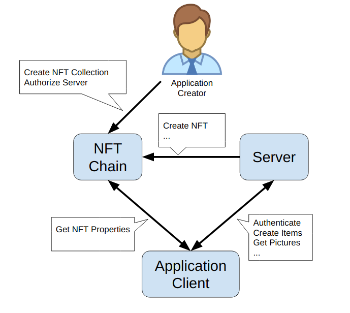
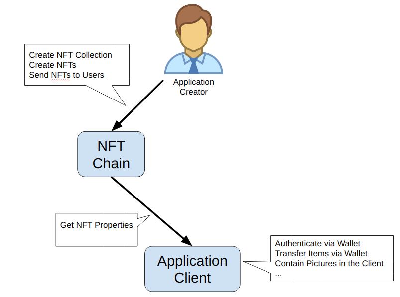

# Building an NFT Application

## Architecture

Both centralized and serverless architectures are supported and application creator can decide which one to use
depending on how much logic and data they intend to manage off-chain and off-line.

### Server-based architecture

In server-based architecture the application creator manually creates NFT collections and authorizes server to perform
operations on each collection. See NFT palette methods that have admin permission level to understand better what server
(or administrators) can do.

### Serverless architecture

In serverless architecture the application creator does all initialization and token distribution manually.
Alternatively, smart contracts may be used in order to implement some distribution mechanics such as token sales or
claiming. The dApp has access to all properties of an NFT token, but it does not have any elevated permissions, since it
resides on user site. All operations happen on user's behalf signed by user's private key.

## Custom Types for JS API

See in root README

## NFT Palette Methods

### Collection Management

#### CreateCollection

##### Description

This method creates a Collection of NFTs. Each Token may have multiple properties encoded as an array of bytes of
certain length. The initial owner and admin of the collection are set to the address that signed the transaction. Both
addresses can be changed later.

##### Permissions

Anyone

##### Parameters

customDataSz: Size of NFT properties data.

##### Events

CollectionCreated CollectionID: Globally unique identifier of newly created collection. Owner: Collection owner

#### ChangeCollectionOwner

##### Description

Change the owner of the collection

##### Permissions

Collection Owner

##### Parameters

CollectionId

#### DestroyCollection

##### Description

DANGEROUS: Destroys collection and all NFTs within this collection. Users irrecoverably lose their assets and may lose
real money.

##### Permissions

Collection Owner

##### Parameters

CollectionId

#### CreateItem

##### Description

This method creates a concrete instance of NFT Collection created with CreateCollection method.

##### Permissions

Collection Owner Collection Admin

##### Parameters

CollectionID: ID of the collection Properties: Array of bytes that contains NFT properties. Since NFT Module is agnostic
of properties’ meaning, it is treated purely as an array of bytes Owner: Address, initial owner of the NFT

##### Events

ItemCreated ItemId: Identifier of newly created NFT, which is unique within the Collection, so the NFT is uniquely
identified with a pair of values: CollectionId and ItemId.

#### BurnItem

##### Description

This method destroys a concrete instance of NFT.

##### Permissions

Collection Owner Collection Admin Current NFT Owner

##### Parameters

CollectionID: ID of the collection ItemID: ID of NFT to burn

##### Events

ItemDestroyed CollectionID ItemId: Identifier of burned NFT

#### AddCollectionAdmin

##### Description

NFT Collection can be controlled by multiple admin addresses (some which can also be servers, for example). Admins can
issue and burn NFTs, as well as add and remove other admins, but cannot change NFT or Collection ownership.

This method adds an admin of the Collection.

##### Permissions

Collection Owner Collection Admin

##### Parameters

CollectionID: ID of the Collection to add admin for Admin: Address of new admin to add

#### RemoveCollectionAdmin

##### Description

Remove admin address of the Collection. An admin address can remove itself. List of admins may become empty, in which
case only Collection Owner will be able to add an Admin.

##### Permissions

Collection Owner Collection Admin

##### Parameters

CollectionID: ID of the Collection to remove admin for Admin: Address of admin to remove

### Item Ownership and Transfers

This group of methods allows managing NFT ownership.

#### GetOwner

##### Description

Return the address of the NFT owner.

##### Permissions

Anyone

##### Parameters

CollectionId ItemId: ID of the NFT

##### Returns

Owner address

#### BalanceOf

##### Description

This method is included for compatibility with ERC-721. Return the total count of NFTs of a given Collection that belong
to a given address.

##### Permissions

Anyone

##### Parameters

CollectionId Address to count NFTs for

##### Returns

Total count of NFTs for Address

#### Transfer

##### Description

Change ownership of the NFT.

##### Permissions

Collection Owner Collection Admin Current NFT owner

##### Parameters

Recipient: Address of token recipient ClassId: ID of item class ItemId: ID of the item

#### TransferFrom

##### Description

Change ownership of a NFT on behalf of the owner. See Approve method for additional information. After this method
executes, the approval is removed so that the approved address will not be able to transfer this NFT again from this
owner.

##### Permissions

Collection Owner Collection Admin Current NFT owner Address approved by current NFT owner

##### Parameters

Recipient: Address of token recipient ClassId: ID of item class ItemId: ID of the item

#### Approve

##### Description

Set, change, or remove approved address to transfer the ownership of the NFT.

##### Permissions

Collection Owner Collection Admin Current NFT owner

##### Parameters

Approved: Address that is approved to transfer this NFT or zero (if needed to remove approval) ClassId: ID of item class
ItemId: ID of the item

#### GetApproved

##### Description

Get the approved address for a single NFT.

##### Permissions

Anyone

##### Parameters

ClassId: ID of item class ItemId: ID of the item

##### Returns

Approved address
